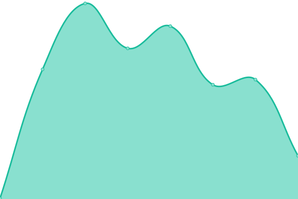
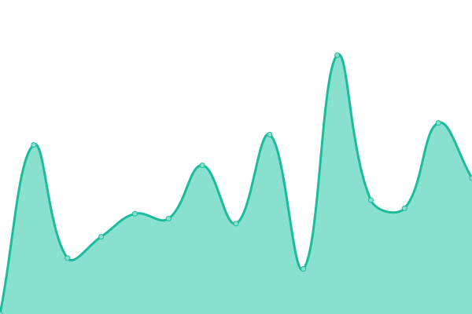

# [📈 Live Status](https://status.rewst.io): <!--live status--> **🟩 All systems operational**

This repository contains the open-source uptime monitor and status page for [Rewst](https://status.rewst.io), powered by [Upptime](https://github.com/upptime/upptime).

With [Upptime](https://upptime.js.org), you can get your own unlimited and free uptime monitor and status page, powered entirely by a GitHub repository. We use [Issues](https://github.com/RewstApp/status.rewst.io/issues) as incident reports, [Actions](https://github.com/RewstApp/status.rewst.io/actions) as uptime monitors, and [Pages](https://status.rewst.io) for the status page.

<!--start: status pages-->
<!-- This summary is generated by Upptime (https://github.com/upptime/upptime) -->
<!-- Do not edit this manually, your changes will be overwritten -->
<!-- prettier-ignore -->
| URL | Status | History | Response Time | Uptime |
| --- | ------ | ------- | ------------- | ------ |
|  Rewst App | 🟩 Up | [rewst-app.yml](https://github.com/RewstApp/status.rewst.io/commits/HEAD/history/rewst-app.yml) | 

 589ms
     
 | 

<a href="https://status.rewst.io/history/rewst-app">100.00%</a>
    

|  Rewst API | 🟩 Up | [rewst-api.yml](https://github.com/RewstApp/status.rewst.io/commits/HEAD/history/rewst-api.yml) | 

 219ms
     
 | 

<a href="https://status.rewst.io/history/rewst-api">100.00%</a>
    

|  Rewst Engine | 🟩 Up | [rewst-engine.yml](https://github.com/RewstApp/status.rewst.io/commits/HEAD/history/rewst-engine.yml) | 

 238ms
     
 | 

<a href="https://status.rewst.io/history/rewst-engine">100.00%</a>
    

|  Rewst CDN | 🟩 Up | [rewst-cdn.yml](https://github.com/RewstApp/status.rewst.io/commits/HEAD/history/rewst-cdn.yml) | 

 232ms
     
 | 

<a href="https://status.rewst.io/history/rewst-cdn">100.00%</a>
    

|  Rewst Workflow | 🟩 Up | [rewst-workflow.yml](https://github.com/RewstApp/status.rewst.io/commits/HEAD/history/rewst-workflow.yml) | 

 9860ms
     
 | 

<a href="https://status.rewst.io/history/rewst-workflow">99.04%</a>
    

<!--end: status pages-->

[**Visit our status website →**](https://status.rewst.io)

## 📄 License

- Powered by: [Upptime](https://github.com/upptime/upptime)
- Code: [MIT](./LICENSE) © [Anand Chowdhary](https://anandchowdhary.com), supported by [Pabio](https://pabio.com)
- Data in the `./history` directory: [Open Database License](https://opendatacommons.org/licenses/odbl/1-0/)
